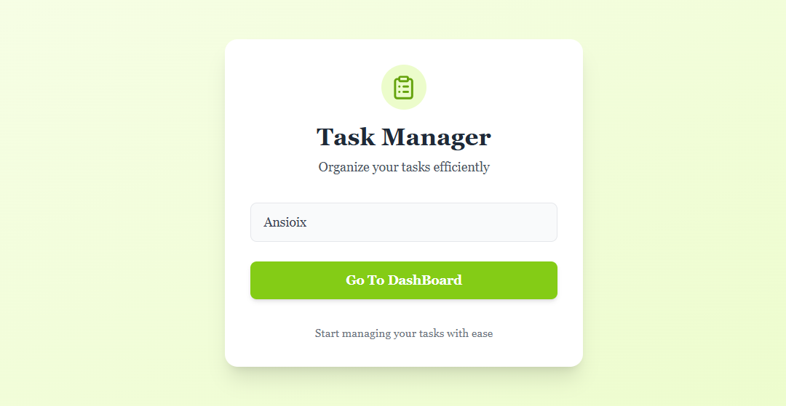
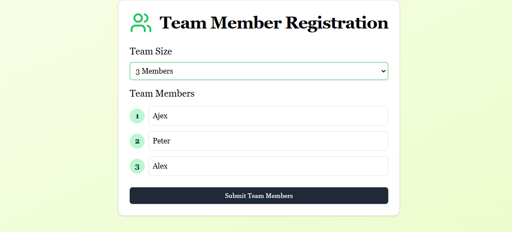
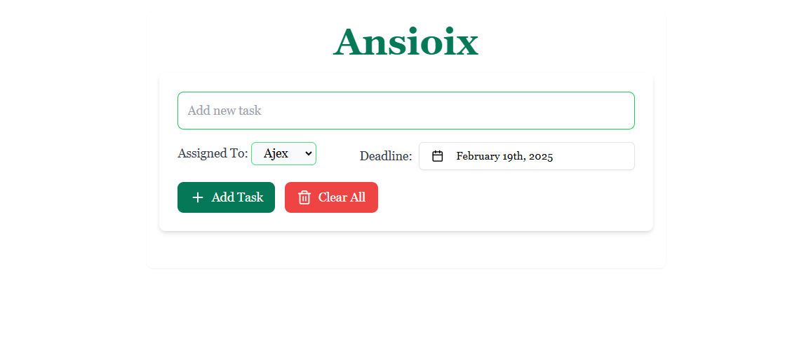

# Task Manager Frontend

This project is a frontend application for a simple task manager, built using React. It allows users to manage tasks for team members, with data persistence through local storage.

<!-- ## ScreenShots

 -->

## Features

* **Company and Member Management:**
    * On the initial visit, users are prompted to enter the company name and the names of team members.
    * This information is stored in local storage, so users don't have to re-enter it on subsequent visits.
* **After first Data, Been Provided, Directly Clicking To 'Go To DashBoard' Works**
* **Task Management:**
    * Add new tasks, assigned team members, and deadlines.
    * Delete individual tasks.
    * Clear all tasks.
* **Task Assignment:**
    * Assign tasks to team members when creating the task.
    * Change the assigned team member for a task *after* it has been created.
* **Data Persistence:**
    * All task data, company name, and member names are stored in the browser's local storage.  This ensures that data is preserved across sessions.

## Technologies Used

* React
* date-fns (for date formatting)
* lucide-react (for icons)
* uuid (for generating unique task IDs)
* Redux Toolkit (for state management)
* tailwindcss (for styling)
* Next js framework

